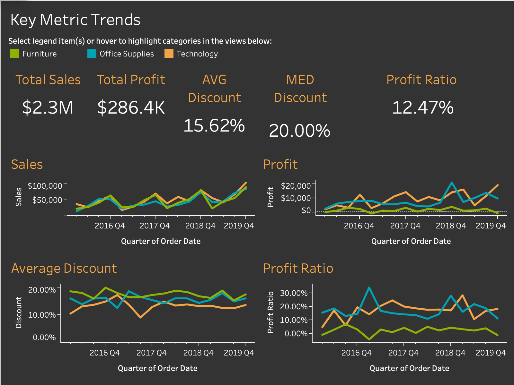
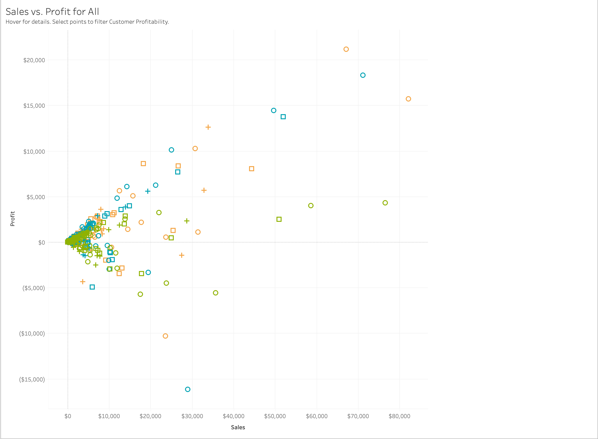

# Superstore Sales and Profitability Dashboard in Tableau

This Tableau project analyzes sales performance, profitability, discounts, customer profitability, subcategory performance, and geographic sales trends using Tableau Superstore sample data.

> **Data Note:** This project uses Tableau Superstore sample data for portfolio demonstration purposes. It does not contain private client data or real customer personal data.

---

## Business Problem

Sales leaders need more than total revenue. They need to understand whether sales are profitable, which regions are contributing the most, which customers are driving profit, and whether discounts are helping or hurting the business.

This dashboard answers:

* Where are sales and profit strongest geographically?
* Which customers generate the most profit?
* Which categories and subcategories are contributing to profit?
* Are sales and profit increasing over time?
* Are discounts affecting profit ratio?
* Where do high sales not convert into strong profit?

---

## Project Preview and Analysis

### Profits by Location Dashboard

This dashboard combines geographic profit performance, sales versus profit, and customer profitability in one executive view. The map shows that profit is not evenly distributed across the United States. Larger profitable markets appear in states such as California and New York, while other states show weaker or negative profit performance.

The New York tooltip shows strong performance with **$74,039 in profit**, **$310,876 in sales**, and a **23.82% profit ratio**. This indicates that New York is not only generating high sales, but also converting sales into strong profit.

The scatter plot shows that higher sales do not always guarantee higher profit. Some points with meaningful sales still sit close to or below the zero profit line, suggesting that discounting, product mix, or cost structure may be reducing margin.

The customer profitability table highlights the most profitable customers, including Tamara Chand, Raymond Buch, Sanjit Chand, Hunter Lopez, and Adrian Barton. This helps sales teams prioritize accounts that are producing meaningful profit, not just revenue.

---

### Key Metric Trends Dashboard

This dashboard shows overall business performance across key metrics. The dashboard shows **$2.3M in total sales**, **$286.4K in total profit**, **15.62% average discount**, **20.00% median discount**, and a **12.47% profit ratio**.

The sales trend shows growth over time, especially toward the later quarters. Profit also fluctuates by category, with Technology and Office Supplies appearing stronger than Furniture in several periods.

The discount and profit ratio trends are important because they show that sales growth alone is not enough. A business also needs to monitor margin quality, discounting behavior, and category level profitability.

---

### Sales vs Profit Analysis

This scatter plot compares sales and profit across category, segment, and state. Most points are clustered near the lower sales and lower profit area, which means many states or segments produce smaller order volume.

A few outliers have much higher sales and profit, which may represent high value states, product categories, or customer segments. However, some high sales points still show weak or negative profit, showing that sales volume does not always equal strong profitability.

This view is useful because it helps business users quickly identify outliers, profitable opportunities, and areas where margin may need review.

---

## Key Insights

| Insight | Business Meaning |
|---|---|
| New York shows strong sales, profit, and profit ratio | This state appears to be a high value market |
| Total sales reached $2.3M and total profit reached $286.4K | The business has strong revenue volume but should monitor margin quality |
| Median discount is 20.00% | Discounting is a major part of the sales strategy |
| Some high sales points have weak or negative profit | Revenue should be reviewed alongside margin |
| Top customers generate meaningful profit | Customer level ranking can support account prioritization |
| Some subcategories appear unprofitable | Product level margin review may be needed |

---

## Tableau Features Used

* Interactive dashboard layout
* Map visualization
* Sales and profit scatter plot
* Customer profitability table
* Subcategory profitability chart
* KPI cards
* Trend charts
* Filters by region and year
* Tooltips
* Category and segment color encoding
* Dashboard actions and highlighting

---

## Skills Demonstrated

* Tableau dashboard design
* Geographic sales and profit analysis
* Customer profitability analysis
* Subcategory profitability analysis
* KPI reporting
* Discount and profit ratio analysis
* Trend analysis over time
* Interactive filtering
* Business intelligence storytelling

---

## Business Recommendations

Based on the dashboard analysis, business leaders could:

* Review low profit or negative profit states
* Study high performing markets such as New York to understand what is working
* Prioritize top profit customers for retention and account management
* Review subcategories with negative profit
* Monitor discounting because the median discount is 20.00%
* Use profit ratio alongside sales to avoid rewarding revenue that does not generate margin

---

## Files Included

| Folder or File | Description |
|---|---|
| `images/profits_by_location.png` | Main dashboard showing geographic profit, sales versus profit, and customer profitability |
| `images/key_metric_trends.png` | KPI and trend dashboard showing sales, profit, discounts, and profit ratio |
| `images/sales_vs_profit.png` | Scatter plot showing sales versus profit by category, segment, and state |
| `workbook/superstore_sales_profitability_dashboard.twbx` | Packaged Tableau workbook file |
| `data/` | Sample data folder if included |
| `README.md` | Project documentation |

---

## Portfolio Note

This project is part of my Tableau Portfolio and supports my broader work in business intelligence, data visualization, dashboard development, SQL, Python, R, and Power BI.

[Back to Tableau Portfolio](../README.md)
