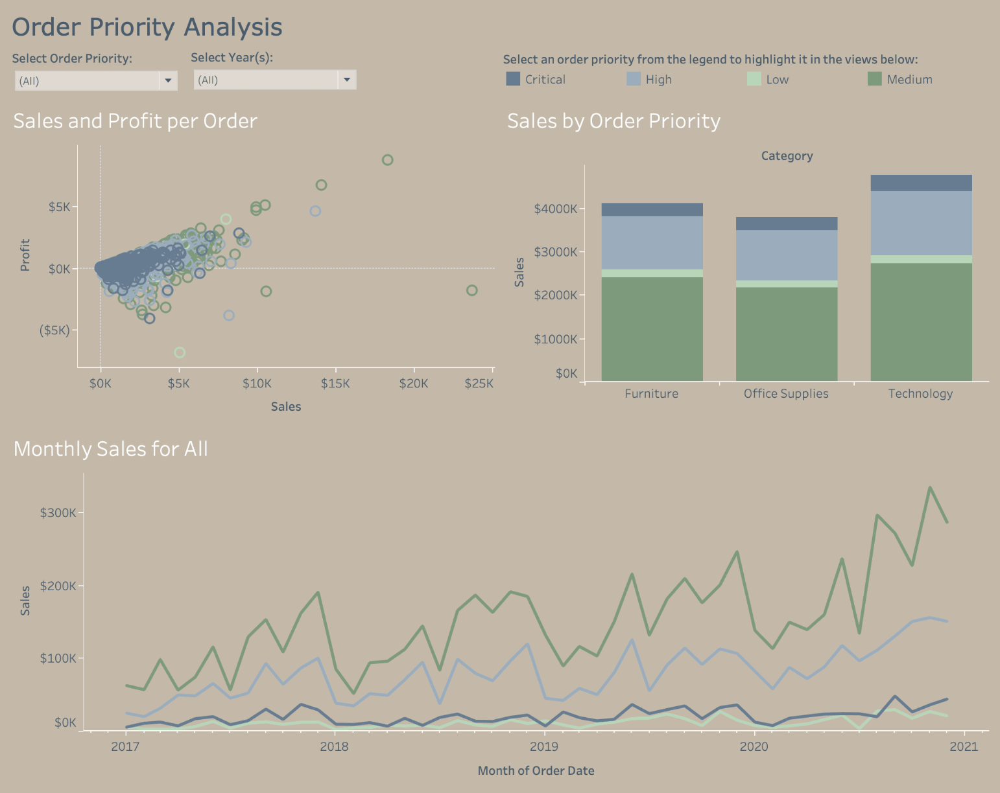
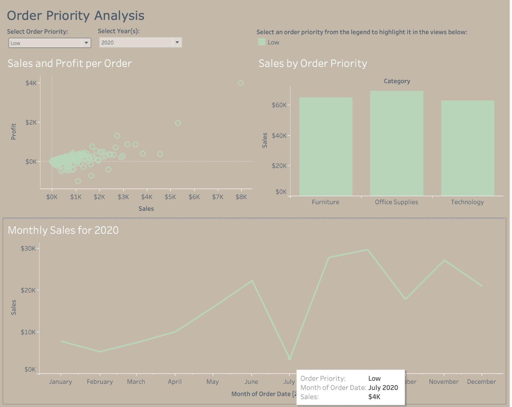
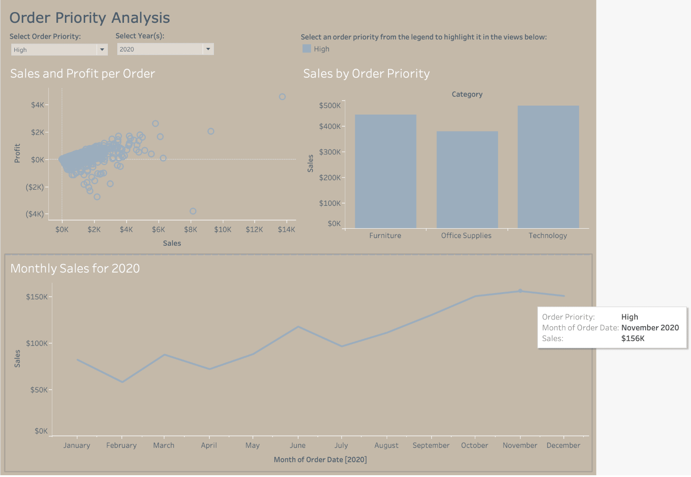

# Order Priority Analysis Dashboard in Tableau

This Tableau project analyzes sales, profit, monthly trends, and category performance by order priority.

The dashboard allows users to filter by order priority and year to understand how Critical, High, Medium, and Low priority orders contribute to sales performance over time.

> **Data Note:** This project uses sample data for portfolio demonstration purposes. It does not contain private client data or real customer personal data.

---

## Project Preview

### All Order Priorities

### Low Priority Orders in 2020

### High Priority Orders in 2020

---

## Business Problem

Operations and sales leaders need to understand how order priority affects sales volume, profitability, category performance, and monthly demand patterns.

This dashboard answers:

* Which order priority groups contribute the most sales?
* How do sales and profit vary across order priority levels?
* Which categories drive sales within each priority group?
* How does monthly sales performance change by priority level?
* Are high priority orders producing meaningfully higher revenue?
* Are lower priority orders still important to category performance?

---

## Dashboard Analysis

### 1. Overall priority performance

The all priority view shows that Medium and High priority orders make up the largest share of sales activity, while Critical and Low priority orders appear much smaller by comparison.

The category bar chart shows that Technology has the highest total sales among the displayed categories, followed by Furniture and Office Supplies. This suggests that order priority analysis should not only look at volume, but also the category mix behind that volume.

---

### 2. Sales and profit per order

The scatter plot shows the relationship between sales and profit per order. Most orders cluster near lower sales values, but there are several higher sales outliers.

The chart shows that larger orders can generate higher profit, but some orders produce negative profit even when sales are meaningful. This indicates that order value alone is not enough to judge performance. Profitability still needs to be reviewed at the order level.

---

### 3. Low priority orders in 2020

When filtered to Low priority orders in 2020, the dashboard shows a smaller sales range compared to High priority orders.

The monthly trend shows Low priority sales fluctuating during the year, with a visible dip around July and stronger activity later in the year.

Approximate category sales in the filtered Low priority view show:

| Category | Approximate Sales |
|---|---:|
| Office Supplies | About $70K |
| Furniture | About $65K |
| Technology | About $62K |

This suggests that Low priority orders are still spread across all major categories and should not be ignored, even though total volume is lower than High priority orders.

---

### 4. High priority orders in 2020

When filtered to High priority orders in 2020, sales are much higher than Low priority orders.

The category view shows Technology as the strongest category, followed by Furniture and Office Supplies.

Approximate category sales in the filtered High priority view show:

| Category | Approximate Sales |
|---|---:|
| Technology | About $500K |
| Furniture | About $455K |
| Office Supplies | About $380K |

The monthly sales line shows an upward pattern through the second half of 2020, with November reaching about $156K. This suggests that High priority orders became especially important later in the year.

---

## Key Insights

| Insight | Business Meaning |
|---|---|
| Medium and High priority orders dominate total sales | These groups likely require the most operational focus |
| High priority orders in 2020 produced much higher category sales than Low priority orders | Priority level is strongly tied to sales volume |
| Technology appears to be the strongest category for High priority sales | Technology orders may require stronger fulfillment planning |
| Low priority orders still contribute across Furniture, Office Supplies, and Technology | Lower priority orders still matter for total category performance |
| Some orders show negative profit | Pricing, discounts, or fulfillment costs may need review |
| November 2020 was a strong month for High priority sales | Seasonal or operational demand patterns may exist |

---

## Dashboard Features

| Feature | Description |
|---|---|
| Order priority filter | Lets users focus on Critical, High, Medium, or Low priority orders |
| Year filter | Allows users to analyze order priority performance by year |
| Sales and profit scatter plot | Shows relationship between sales and profit per order |
| Sales by order priority | Compares category sales across priority groups |
| Monthly sales trend | Shows how sales change over time |
| Interactive highlighting | Lets users select a priority group from the legend to highlight related marks |

---

## Tableau Features Used

* Interactive filters
* Priority based filtering
* Sales and profit scatter plot
* Category bar chart
* Monthly sales line chart
* Tooltips
* Legend based highlighting
* Dashboard layout design
* Color encoding by priority group

---

## Skills Demonstrated

This project demonstrates:

* Tableau dashboard design
* Order priority analysis
* Sales and profit analysis
* Category performance comparison
* Monthly trend analysis
* Interactive filtering
* Tooltip design
* Business intelligence storytelling

---

## Business Recommendations

Based on the dashboard analysis, business leaders could:

* Monitor High and Medium priority orders closely because they drive the largest sales volume
* Review negative profit orders to understand whether discounts or fulfillment costs are reducing margin
* Plan capacity around High priority orders because they show larger monthly sales patterns
* Review Technology order trends because Technology appears to lead sales in High priority orders
* Continue tracking Low priority orders because they still contribute across all major categories

---

## Files Included

| Folder or File | Description |
|---|---|
| `images/order_priority_all.png` | Dashboard view showing all order priorities |
| `images/order_priority_low_2020.png` | Dashboard filtered to Low priority orders in 2020 |
| `images/order_priority_high_2020.png` | Dashboard filtered to High priority orders in 2020 |
| `data/` | Sample data folder if included |
| `README.md` | Project documentation |

---

## Portfolio Note

This project is part of my Tableau Portfolio and supports my broader work in business intelligence, data visualization, dashboard development, SQL, Python, R, and Power BI.

[Back to Tableau Portfolio](../README.md)
