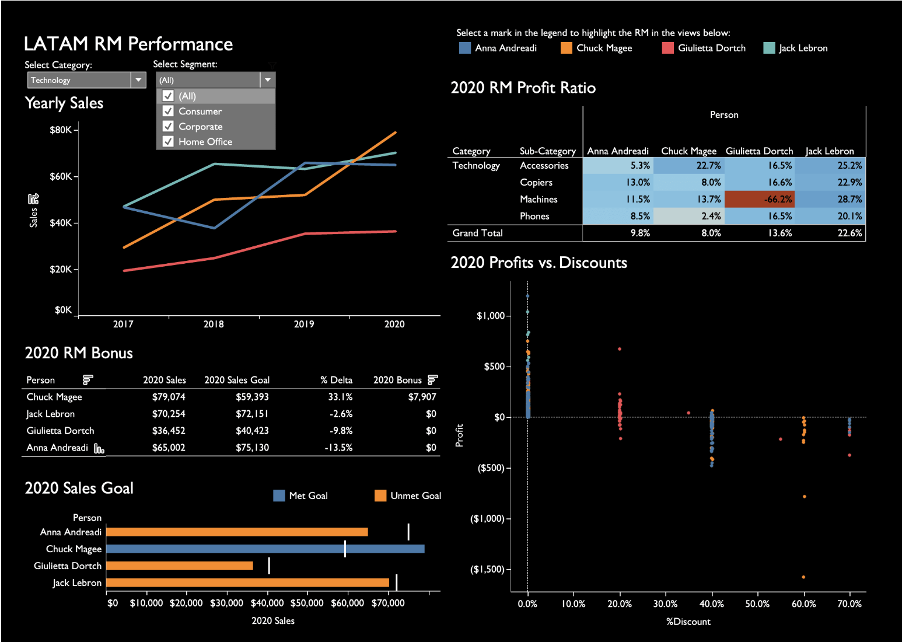
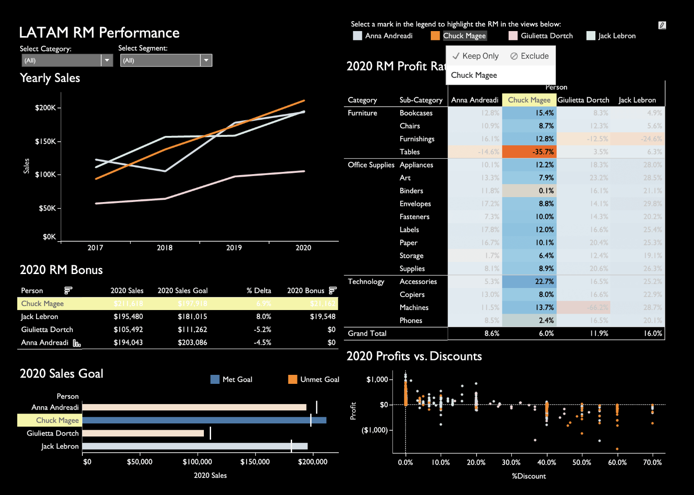

# LATAM RM Performance Dashboard in Tableau

This Tableau dashboard analyzes LATAM relationship manager performance across yearly sales, sales goals, bonus outcomes, profit ratio, and profits versus discounts.

> **Data Note:** This project uses sample data for portfolio demonstration purposes only. It does not contain private business data, client data, or real personal data.

---

## Business Problem

Sales leaders need to evaluate relationship manager performance in a way that balances sales growth, goal achievement, bonus eligibility, discount behavior, and profitability.

This dashboard answers:

* Which relationship managers are driving the most sales?
* Which relationship managers met or missed 2020 sales goals?
* Who earned a bonus based on performance?
* Which RM has the strongest profit ratio?
* Which product categories and subcategories have weak profitability?
* Are discounts reducing profit outcomes?
* How does performance change when filtering by category and segment?

---

## Project Preview and Analysis

### LATAM RM Performance Overview

This overview shows the full LATAM RM performance dashboard with all categories and segments selected. It compares relationship managers across yearly sales, 2020 bonus results, sales goal
cat >> 03_LATAM_RM_Performance_Tableau/README.md <<'EOF'
attainment, RM profit ratio, sales goal status, and profits versus discounts.

Chuck Magee and Jack Lebron both exceeded their 2020 sales goals and earned bonuses. Chuck had the highest 2020 sales at **$211,618**, while Jack had **$195,480** in 2020 sales. Anna Andreadi had strong sales at **$194,043**, but missed her goal because her target was higher. Giulietta Dortch had the lowest 2020 sales at **$105,492** and also missed goal.

The dashboard shows that sales performance and goal performance are not the same thing. Anna had sales close to Jack, but Jack exceeded goal while Anna missed goal. This makes goal context important for fair performance review.

---

### LATAM RM Performance Filtered to Technology

This view filters the dashboard to the Technology category. Chuck Magee leads Technology sales with **$79,074** in 2020 sales against a **$59,393** goal, beating goal by **33.1%** and earning a **$7,907** bonus.

Jack Lebron had **$70,254** in Technology sales but missed his Technology goal by **2.6%**. Anna Andreadi had **$65,002** in Technology sales and missed goal by **13.5%**. Giulietta Dortch had **$36,452** in Technology sales and missed goal by **9.8%**.

This filtered view shows why category level analysis matters. Chuck was the clear Technology sales leader, but Jack still showed the strongest Technology profit ratio at **22.6%**. Chuck drove more volume, while Jack produced stronger profitability.

---

### LATAM RM Performance Full Dashboard View

This full dashboard view shows how several performance metrics work together. The sales trend shows growth over time by RM. The profit ratio heatmap compares profitability by RM and subcategory. The bonus table shows sales, goals, percent delta, and bonus amounts. The scatter plot compares profit against discount levels.

One key insight is that Chuck Magee had the highest 2020 sales and largest bonus, but Jack Lebron had the strongest overall profit ratio at **16.0%**. This means sales leadership should not evaluate performance only by revenue or bonus. Profitability should also be part of the performance conversation.

The profits versus discounts scatter plot shows that higher discounts often appear close to or below zero profit. This suggests discounting may be reducing margin and should be monitored alongside sales goals.

---

## Key Insights

| Insight | Business Meaning |
|---|---|
| Chuck Magee had the highest 2020 sales and largest bonus | Strong sales performance and goal achievement |
| Jack Lebron had the strongest overall profit ratio at 16.0% | Strong margin performance despite slightly lower sales than Chuck |
| Anna Andreadi had high sales but missed goal | Goal context matters when evaluating performance |
| Giulietta Dortch had the lowest 2020 sales and missed goal | May need sales coaching or pipeline review |
| Chuck led Technology sales by a wide margin | Strong category level performance in Technology |
| Jack had the strongest Technology profit ratio | Jack may be selling with stronger pricing or margin discipline |
| Higher discounts appear connected to weaker profit outcomes | Discounting strategy should be reviewed |

---

## Dashboard Features

| Feature | Description |
|---|---|
| Category filter | Lets users focus on a specific product category or view all categories |
| Segment filter | Lets users analyze performance by customer segment |
| Yearly sales trend | Compares sales growth by RM across years |
| 2020 RM profit ratio heatmap | Shows profit ratio performance by subcategory and RM |
| 2020 RM bonus table | Compares 2020 sales, goals, delta, and bonus by RM |
| 2020 sales goal chart | Highlights whether each RM met or missed goal |
| 2020 profits vs discounts scatter plot | Shows the relationship between discount level and profit |
| Legend highlight action | Allows the user to highlight an RM across the dashboard |

---

## Tableau Features Used

* Interactive filters
* Highlight actions
* Multi view dashboard layout
* Sales trend line chart
* Heatmap style profit ratio matrix
* Performance summary table
* Goal comparison bar chart
* Scatter plot analysis
* KPI oriented dashboard storytelling
* Custom formatting
* Dark dashboard theme

---

## Skills Demonstrated

This project demonstrates:

* Tableau dashboard design
* Sales performance analysis
* Relationship manager performance reporting
* Goal attainment tracking
* Bonus analysis
* Profit ratio analysis
* Discount impact analysis
* Interactive filtering
* Heatmap style performance comparison
* Scatter plot analysis
* Comparative business reporting
* Visual business storytelling

---

## Business Recommendations

Based on the dashboard analysis, leadership could:

* Recognize Chuck Magee and Jack Lebron for meeting sales goals
* Review Jack Lebron’s approach because he had the strongest profit ratio
* Coach Anna Andreadi on goal attainment since sales were high but below target
* Review Giulietta Dortch’s pipeline and sales strategy
* Investigate subcategories with negative or weak profit ratios
* Review discounting practices where high discounts appear connected to low or negative profit
* Balance bonus decisions with both sales attainment and profit quality

---

## Files Included

| Folder or File | Description |
|---|---|
| `images/latam_rm_performance_overview.png` | Overview dashboard screenshot |
| `images/latam_rm_performance_technology.png` | Dashboard filtered to Technology |
| `images/latam_rm_performance_full_dashboard.png` | Full dashboard screenshot |
| `data/` | Sample data folder if included |
| `README.md` | Project documentation |

---

## Portfolio Note

This project is part of my Tableau Portfolio and supports my broader work in business intelligence, dashboard development, data visualization, SQL, Python, R, and Power BI.

[Back to Tableau Portfolio](../README.md)
