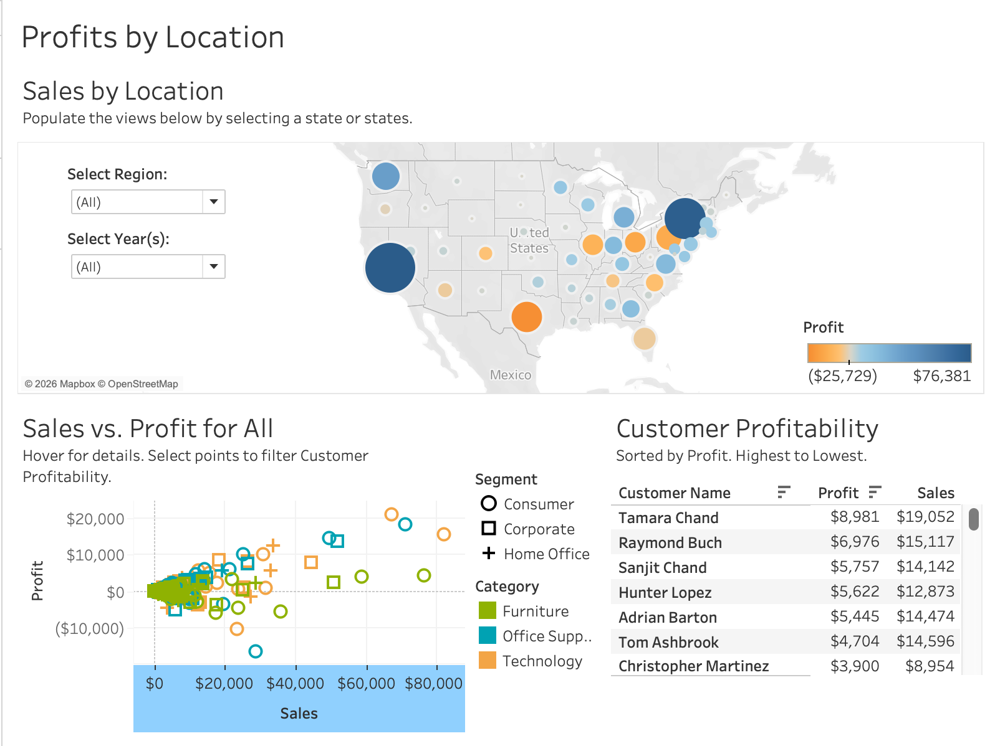
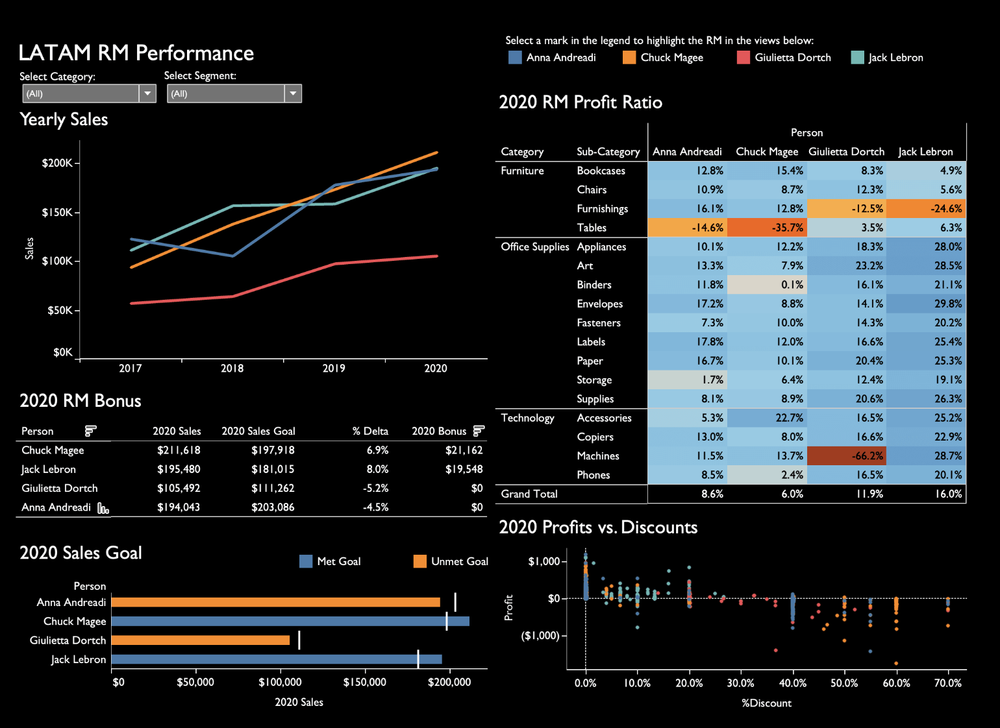

# Tableau Portfolio

This Tableau portfolio showcases dashboard design, data visualization, business intelligence reporting, sales analysis, profitability analysis, KPI reporting, geographic analysis, and executive level dashboard storytelling.

The projects in this portfolio demonstrate how Tableau can be used to turn raw or sample business data into clear, interactive dashboards that help users understand performance, identify trends, compare categories, and make better data driven decisions.

> **Data Note:** Projects in this portfolio use sample data or portfolio demonstration data. They do not contain private client data, confidential business data, or real personal customer data.

---

## Core Skills Demonstrated

---

## Projects

| Project | Focus | Status |
|---|---|---|
| [Superstore Sales and Profitability Dashboard](01_Superstore_Sales_Profitability_Tableau) | Sales performance, profit analysis, discounts, customer profitability, geographic analysis, and trend reporting | Complete |
| [Order Priority Analysis Dashboard](02_Order_Priority_Analysis_Tableau) | Order priority analysis, sales trends, category performance, priority based filtering, and profit review | Complete |
| [LATAM RM Performance Dashboard](03_LATAM_RM_Performance_Tableau) | Relationship manager performance, sales goals, bonus analysis, profit ratio analysis, and discount impact review | Complete |

---

# Featured Tableau Projects

## 1. Superstore Sales and Profitability Dashboard

This dashboard analyzes sales performance, profitability, discounts, customer profitability, subcategory performance, and geographic trends using Tableau Superstore sample data.

The project includes a location based profit dashboard, KPI trend dashboard, and sales versus profit analysis. It highlights key metrics such as **$2.3M in total sales**, **$286.4K in total profit**, **15.62% average discount**, **20.00% median discount**, and a **12.47% profit ratio**.

### Business Value

This dashboard helps users identify profitable locations, high value customers, margin issues, discount impact, and product areas that may need review.

[View Project](01_Superstore_Sales_Profitability_Tableau)

---

## 2. Order Priority Analysis Dashboard

This dashboard analyzes sales, profit, monthly trends, and category performance by order priority.

The project compares all order priorities, Low priority orders in 2020, and High priority orders in 2020. It shows that High and Medium priority orders drive the largest sales volume, while lower priority orders still contribute across major categories.

### Business Value

This dashboard helps operations and sales teams understand how order priority affects sales volume, category performance, profitability, and monthly demand patterns.

[View Project](02_Order_Priority_Analysis_Tableau)

---

## 3. LATAM RM Performance Dashboard

This dashboard analyzes LATAM relationship manager performance across yearly sales, sales goals, bonus outcomes, profit ratio, and profits versus discounts.

The project compares relationship managers across goal attainment, bonus results, profitability, Technology category performance, and discount behavior. It shows that Chuck Magee had the highest 2020 sales and largest bonus, while Jack Lebron had the strongest overall profit ratio.

### Business Value

This dashboard helps sales leadership evaluate relationship manager performance using both sales attainment and profitability, not just revenue volume.

[View Project](03_LATAM_RM_Performance_Tableau)

---

# Portfolio Summary

This Tableau portfolio demonstrates the full dashboard development workflow from visual exploration to business insight.

| Area | What It Shows |
|---|---|
| Dashboard Design | Clean dashboard layouts, visual hierarchy, KPI cards, filters, and business focused views |
| Sales Analysis | Sales by category, state, priority, relationship manager, and year |
| Profitability Analysis | Profit ratio, profit by location, profit by customer, and profit versus discount behavior |
| Geographic Analysis | Map based sales and profit performance |
| Trend Analysis | Sales and profit trends over time |
| Interactive Reporting | Filters, highlighting, legends, and dashboard user exploration |
| Business Storytelling | Turning Tableau visuals into clear recommendations and decision support |

---

# Business Problems These Projects Solve

| Business Problem | Tableau Solution |
|---|---|
| Leaders need to understand sales performance quickly | KPI dashboards and sales trend visuals |
| Revenue does not always equal profit | Profit ratio analysis and sales versus profit scatter plots |
| Regional performance varies | Map based location analysis |
| Customers differ in value | Customer profitability ranking |
| Order priority affects operations | Priority based sales and profit analysis |
| Sales teams need performance visibility | RM scorecards, goal tracking, and bonus analysis |
| Discounts may reduce margin | Profit versus discount analysis |
| Executives need clear summaries | Dashboard layouts with business focused insights |

---

# Tools and Techniques Used

* Tableau dashboard design
* Tableau worksheets and dashboards
* Interactive filters
* Highlight actions
* Map visualizations
* Scatter plots
* Bar charts
* Line charts
* KPI cards
* Heatmap style tables
* Profit ratio analysis
* Sales trend analysis
* Customer ranking
* Category and subcategory analysis
* Dashboard storytelling

---

# Related Portfolios

| Portfolio | Link |
|---|---|
| Data Science Portfolio | [View Portfolio](https://github.com/ashlynstrickland23/Data_Analytics_Portfolio) |
| Power BI Portfolio | [View Portfolio](https://github.com/ashlynstrickland23/PowerBI_Portfolio) |
| SQL Portfolio | [View Portfolio](https://github.com/ashlynstrickland23/SQL_Portfolio) |
| Python Portfolio | [View Portfolio](https://github.com/ashlynstrickland23/Python_Portfolio) |
| R Portfolio | [View Portfolio](https://github.com/ashlynstrickland23/R_Portfolio) |

---

# Contact

Thank you for viewing my Tableau portfolio.

I am open to business intelligence, dashboard development, Tableau, Power BI, SQL reporting, Python analytics, R analytics, data science, data engineering, and data analytics opportunities.

  

  

  

  

